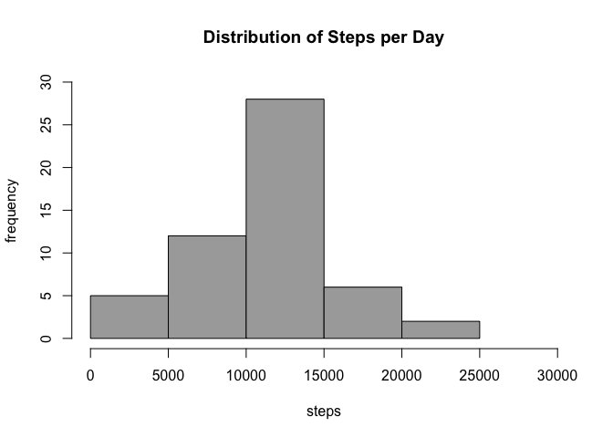
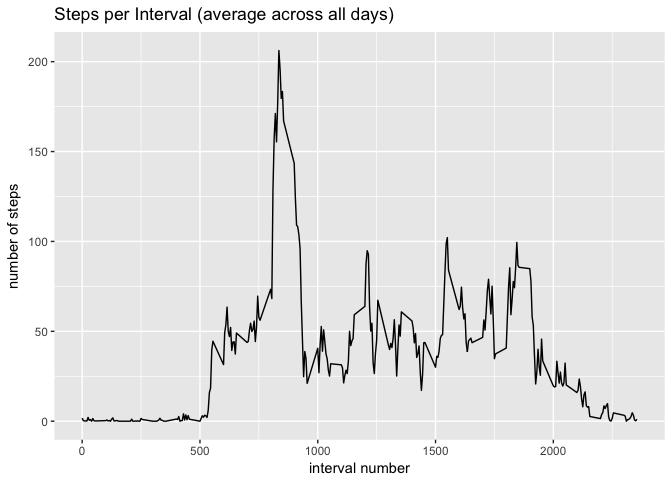
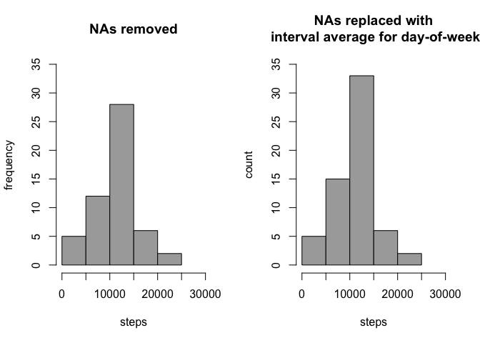
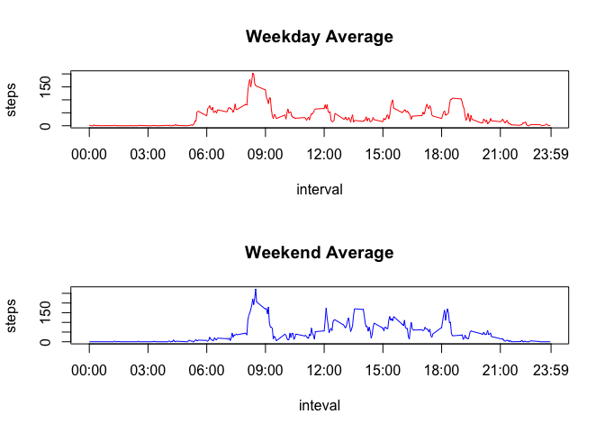

```r
knitr::opts_chunk$set(fig.path='figures/')
```
## Loading and preprocessing the data

```r
# Load packages
library(dplyr)
library(ggplot2)
library(lubridate)
library(reshape2)
```

```r
ds <- read.csv("activity.csv")
ds$date <- ymd(ds$date) # Convert to date
str(ds)
```

```
## 'data.frame':	17568 obs. of  3 variables:
##  $ steps   : int  NA NA NA NA NA NA NA NA NA NA ...
##  $ date    : Date, format: "2012-10-01" "2012-10-01" ...
##  $ interval: int  0 5 10 15 20 25 30 35 40 45 ...
```
### Characteristics of the data
* The data set has 17,568 observations, collected at 5-minute intervals during a period of 61 days (between 2012-10-01 and 2012-11-30).
* The interval value ranges from 0 to 2,355. Given that there are 12 5-minute intervals per hour, there are only 288 intervals per day. This results in gaps between values (x)55 and (x+1)00 (where x represents the hour of the day). 
* There are 2,304 observations with missing data (the step count).
* If one ignores the missing data, there are measurements for 53 days. 
* The number of steps taken during any given interval ranges from 0 to 806.

## What is the mean total number of steps taken per day?

```r
# Calculate steps per day (spd) for each day (omitting missing values)
spd <- aggregate(steps ~ date, data = ds, sum, na.rm = TRUE)
str(spd)
```

```
## 'data.frame':	53 obs. of  2 variables:
##  $ date : Date, format: "2012-10-02" "2012-10-03" ...
##  $ steps: int  126 11352 12116 13294 15420 11015 12811 9900 10304 17382 ...
```
### Plot a histogram of the total number of steps taken each day
Because the steps per days is a continuous variable, there is no right number of bins in which to group the histogram. After considering various options (see the BinWidthOptions files for more details), I used the square root of the number of observations.

```r
numBins = sqrt(length(spd[[1]]))

hist(spd$steps, breaks = numBins, col = "darkgray",
    xlim = c(0, 30000), ylim = c(0, 30),  
    main = "Distribution of Steps per Day", 
    xlab = "steps", ylab = "frequency")
```

<!-- -->
  
3. Calculate and report the mean and median of the total steps taken per day.  

The mean (10,766.19), and the median (10,765) have roughly the same value.

```r
mean(spd$steps, na.rm = TRUE)
```

```
## [1] 10766.19
```

```r
median(spd$steps, na.rm = TRUE)
```

```
## [1] 10765
```

## What is the average daily activity pattern?
1. Make a time series plot of the 5-min interval (x-axis) and the average number of steps taken, averaged across all days (y-axis)

```r
# Calculate the average, grouped by interval. The resulting matrix will be used as a
# look-up table to access the Average for any given interval
avg <- tapply(ds$steps, ds$interval, mean, na.rm = TRUE)

g <- ggplot(melt(avg, value.name = "Average", varnames=c('Interval')), 
            aes(x = Interval, y = Average)) + geom_line() + 
            labs(x = "interval number", y = "number of steps", 
            title = "Steps per Interval (average across all days)")
print(g)
```

<!-- -->
  
2. Which 5-minute interval, on average across all the days in the dataset, contains the maximum number of steps?  

Interval 835 has the maximum number of steps, on average across all the days. (206.1698 steps)

```r
maxInterval <- names(avg)[which.max(avg)]
avg[as.character(maxInterval)]
```

```
##      835 
## 206.1698
```

## Imputing missing values
1. Calculate and report the total number of missing values in the dataset (i.e. the total number of rows with NAs).  

There are 2304 missing values in the dataset which correspond exactly to the data for 8 complete days (out of the 61 total days).

```r
sum(is.na(ds))
```

```
## [1] 2304
```

```r
length(unique(filter(ds, is.na(steps))$date))
```

```
## [1] 8
```
  
2. Devise a strategy for filling in all of the missing values in the dataset. 

The missing values have been filled with the interval average for the corresponding day of week. I chose this option after also considering the interval average, across all days.

Calculate averages across interval and day of week

```r
avg2 <- tapply(ds$steps, list(ds$interval, wday(ds$date)), mean, na.rm = TRUE)
```

3. Create a new dataset that is equal to the original dataset but with the missing data filled in.

```r
# Create a new filled data set (fds) using interval averages across days of week
fds <- ds %>% rowwise() %>% 
    mutate(steps = ifelse(is.na(steps), 
                          avg2[as.character(interval), wday(date)], 
                          steps))
# No missing values in new data set
sum(is.na(fds))
```

```
## [1] 0
```

4. Make a histogram of the total number of steps taken each day. 


```r
# Calculate steps per day (spd) for each day 
spd2 <- aggregate(steps ~ date, data = fds, sum)

par(mfrow = c(1, 2))

hist(spd$steps, breaks = numBins, 
    col = "darkgray",
    xlim = c(0, 30000), ylim = c(0, 35), 
    main = "NAs removed", 
    xlab = "steps", ylab = "frequency")
hist(spd2$steps, breaks = numBins,
    col = "darkgray",
    xlim = c(0, 30000), ylim = c(0, 35), 
    main = "NAs replaced with\n interval average for day-of-week", 
    xlab = "steps", ylab = "count")
```

<!-- -->

5. Calculate and report the mean and median total number of steps taken per day

|              | With missing values removed | With missing values imputed |
|--------------|---------------------------- |------------------------------
| Total steps  | 570,608 | 660,093.8
| Mean         | 10,766.19 |  10,821.21 |
| Median       | 10,765 | 11,015 |


```r
sum(spd$steps, na.rm = TRUE)
```

```
## [1] 570608
```

```r
sum(spd2$steps, na.rm = TRUE)
```

```
## [1] 660093.8
```

```r
mean(spd$steps, na.rm = TRUE)
```

```
## [1] 10766.19
```

```r
mean(spd2$steps, na.rm = TRUE)
```

```
## [1] 10821.21
```

```r
median(spd$steps, na.rm = TRUE)
```

```
## [1] 10765
```

```r
median(spd2$steps, na.rm = TRUE)
```

```
## [1] 11015
```

Do these values differ from the estimates from the first part of the assignment?  
Yes. 

What is the impact of imputing missing data on the estimates of the total daily number of steps?  
The median and mean are higher, because some of the imputed values were higher (when considering interval average of day of week than the interval average across all days.)

## Are there differences in activity patterns between weekdays and weekends?
Yes, activity increases (from a resting state) earlier on weekdays than on weekends.

1. Create a new factor variable in the dataset with two levels – “weekday” and “weekend” indicating whether a given date is a weekday or weekend day.

```r
fds$group <- as.factor(ifelse(wday(fds$date) %in% c(6,7), "Weekend", "Weekday"))
```
2. Make a panel plot containing a time series plot (i.e. 𝚝𝚢𝚙𝚎 = "𝚕") of the 5-minute interval (x-axis) and the average number of steps taken, averaged across all weekday days or weekend days (y-axis).

```r
avg3 <- tapply(fds$steps, list(fds$interval, fds$group), mean, na.rm = TRUE)

par(mfrow = c(2, 1))
axisTicks  <- c(0, 300, 600, 900, 1200, 1500, 1800, 2100, 2359)
axisLabels <- c("00:00", "03:00", "06:00", "09:00", "12:00", "15:00", "18:00", "21:00", "23:59") 
plot(rownames(avg3), avg3[,'Weekday'], type="l", col = "red",
     xlab = "interval", ylab = "steps", main = "Weekday Average",
     xaxt="n") # Surpress X-axis to add custom ticks below
axis(1, at = axisTicks, labels = axisLabels)
 
plot(rownames(avg3), avg3[,'Weekend'], type="l", col = "blue",
     xlab = "inteval", ylab = "steps", main = "Weekend Average",
     xaxt="n") # Surpress X-axis to add custom ticks below
axis(1, at = axisTicks, labels = axisLabels)
```

<!-- -->
