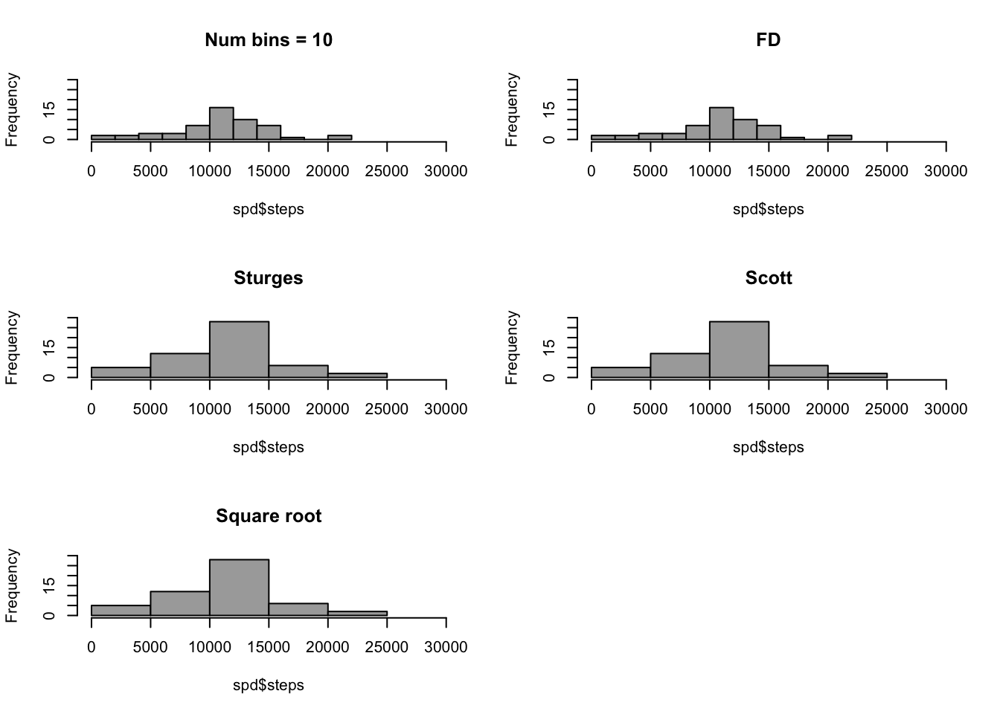

Given that the average steps per day is a continuous variable, I had to define the number of bins for the histogram. This document describes the options I considered.

After reading the documentation listed in the Sources section below, I considered the following different options:  

* 10 (my initial "guesstimate")
* the options provided by the hist() function:  
    + the Sturges formula 
    + the Freedman–Diaconis rule
    + the Scott method
 * the square root of the number of observations (used by Excel)

I plotted the different options (see plots below) and saw that there were two results. I decided to go with the result produced by the majority of the options (3 out of 5), and I used 
square root, given that it would be easier to calculate should I want to use ggplot.


```r
# Load packages 
library(dplyr)
library(ggplot2)
library(lubridate)
```

```r
# Load data
ds <- read.csv(file.path("../", "activity.csv"))
ds$date <- ymd(ds$date)

# Calculate steps per day (spd) for each day (omitting missing values)
spd <- aggregate(steps ~ date, data = ds, sum, na.rm = TRUE)
```


```r
numBins = sqrt(length(spd[[1]]))

par(mfrow = c(3, 2))

hist(spd$steps, col = "darkgray", xlim = c(0, 30000), ylim = c(0, 30),
     breaks = 10, main = "Num bins = 10")
hist(spd$steps, col = "darkgray", xlim = c(0, 30000), ylim = c(0, 30),
     breaks = "FD", main = "FD")
hist(spd$steps, col = "darkgray", xlim = c(0, 30000), ylim = c(0, 30),
     breaks = "Sturges", main = "Sturges")
hist(spd$steps, col = "darkgray", xlim = c(0, 30000), ylim = c(0, 30),
     breaks = "Scott", main = "Scott")
hist(spd$steps, col = "darkgray", xlim = c(0, 30000), ylim = c(0, 30),
     breaks = numBins, main = "Square root")
```

<!-- -->

###Sources 
https://stats.stackexchange.com/questions/798/calculating-optimal-number-of-bins-in-a-histogram
https://en.wikipedia.org/wiki/Histogram#Number_of_bins_and_width
